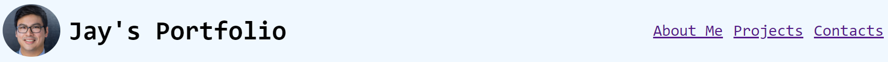
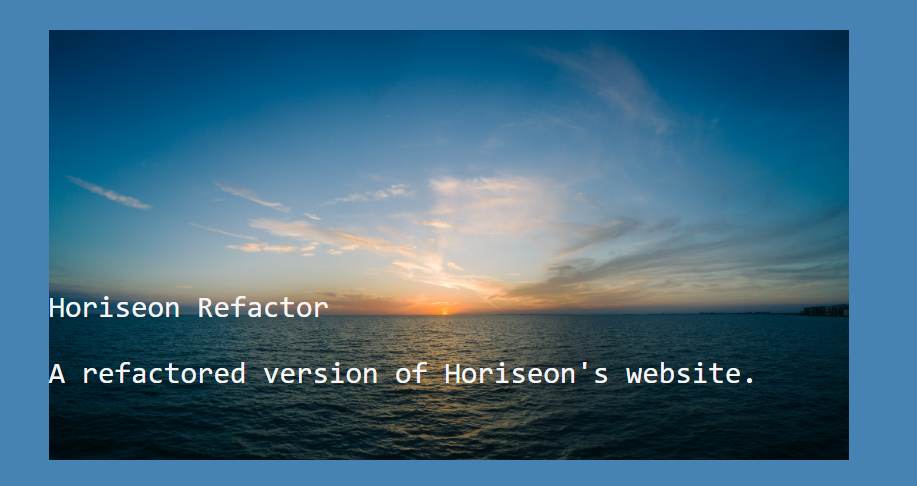
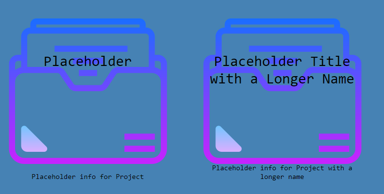
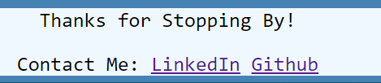

# Portfolio

## Description

The purpose of this website is to serve as a portfolio for potential employers to examine the projects that I have have completed in both bootcamp and on my own.

As time goes on and I obtain more experience, this site will be updated with higher quality projects. The CSS will most likely remain unchanged, as they are not where I will be focusing my immediate attention. Though I will maintain the general CSS at a minimum.

## Installation

Simply visit click here to visit the [Portfolio](https://chapjae.github.io/portfolio/)

## Usage
This section will describe the current interactive elements of the portfolio app:

*The header navbar contains the three bookmark links for quickly navigated to specific sections of the website.*

*When a user clicks on this image, a new tab will open in their browser and take them to the Horiseon refactor project.*

*Currently, there are four folder icons that serve as placeholders for future projects that will be linked to this website. They have a simple animation that will play when the user hovers over them.*

*The footer contains two links that will open a new tab in the user's browser and navigate to their specific external links.*

## Technologies Used

HTML
CSS

<a target="_blank" href="https://icons8.com/icon/44005/folder">Folder</a> icon by <a target="_blank" href="https://icons8.com">Icons8</a>

<a target="_blank" href="https://icons8.com/icon/44032/opened-folder">Opened Folder</a> icon by <a target="_blank" href="https://icons8.com">Icons8</a>